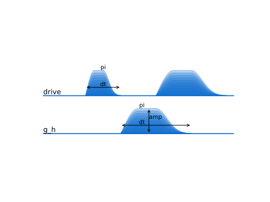

Custom example
---

```python


import matplotlib.pyplot as plt
import numpy as np

from pulsefig import Element, Line

fig, ax = plt.subplots(1, 1)

# Define a line with elements attached
line1 = Line("drive").attach_elements(
    Element(0, 1)
    .attach_func(lambda x: np.sin(x * 2 * np.pi), end=0.25)
    .attach_func(lambda x: np.exp(-((x - 0.5) ** 2) / 0.05), start=0.5, end=1)
    .update_style(alpha=0.3, data_index=0)
    .sweep_height(start_alpha=0.1)
    .set(subtitle="pi", xlabel="dt"),
    Element(2, 4)
    .attach_func(lambda x: np.sin(x * 2 * np.pi), end=0.25)
    .attach_func(lambda x: np.exp(-((x - 0.5) ** 2) / 0.05), start=0.5, end=1)
    .update_style(alpha=0.3, data_index=0)
    .sweep_height(start_alpha=0.1),
)

# Define another line
line2 = Line("g_h").attach_elements(
    Element(1, 3)
    .set(alpha=0.3, marker="0")
    .set_subtitle("pi", xpos=0.3)
    .set_ylabel("amp", xpos=0.4, ypos=0.65)
    .set_xlabel("dt", xpos=0.3)
    .attach_func(lambda x: np.sin(x * 2 * np.pi), end=0.25)
    .attach_func(lambda x: np.exp(-((x - 0.5) ** 2) / 0.05), start=0.5, end=1)
    .update_style(alpha=0.3, data_index=0)
    .sweep_height(start_alpha=0.1),
)

# Combine the lines into an ensemble and draw
(line1 + line2).draw(ax).config_ax(ax)

fig.savefig("../figures/example_3.svg")

```
 